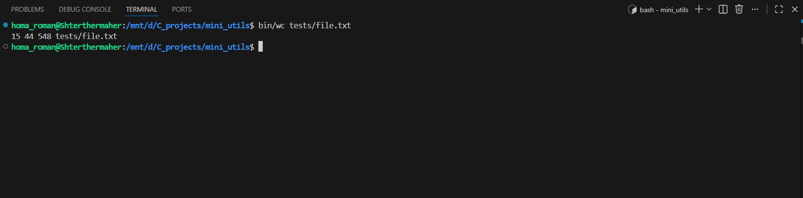
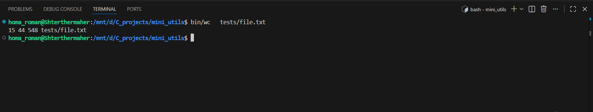

<h1>Mini_utils</h1>
<p>
A small collection of Unix-like command-line utilities written in C.
The goal of this project is to practice systems programming, clean C architecture,
and Unix-style CLI design.</p>

## Usage

### Clone the repository:

```
https://github.com/Misterparadise/mini-utils.git
```
### Run cat

```
bin/cat tests/file.txt
```

### Run wc

```
bin/wc tests/file.txt
```

<h2>Currently implemented</h2>
<p> cat — concatenate files and print on standard output</p>
<p> wc  — calculates a file's word, line, character, or byte count.</p>

<h2>Features</h2>
<ul>
<li> Read and print one or multiple files</li>
<li> Works with relative and absolute paths</li>
<li> Unix-style CLI behavior</li>
<li> Outputs the line, word, and byte counts</li>
</ul>


<h2>Examples</h2>

#### wc util



#### cat util



